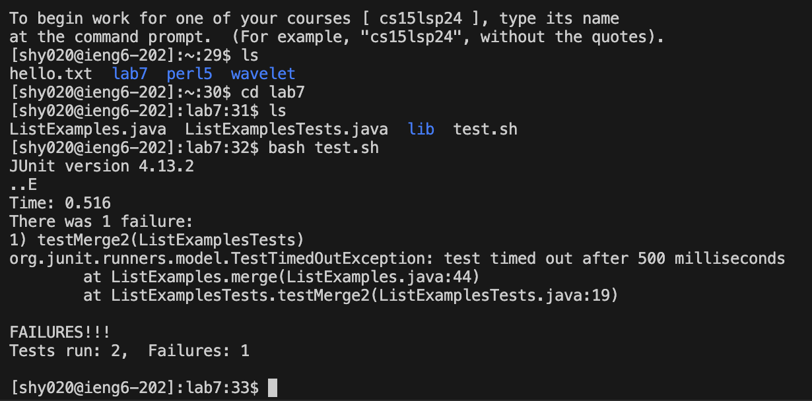
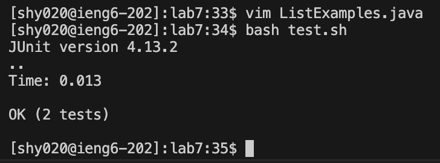

## Lab Report 4

# Step4:

`ssh<space>shy020@ieng6.ucsd.edu<enter>`
I used `ssh` command to log into ieng6.
I used `<space>` and `<enter>` keys to successfully run the command.
# Step5:

`git<space>clone<space>https://github.com/ArthurYangCN/lab7<enter>`
I used `git` command to clone the file.
I used <space> and <enter> keys to successfully run the command.

# Step6:
`bash<space>test.sh<enter>`
I used `bash` command to run the test command in `test.sh` file.
I used <space> and <enter> keys to successfully run the command.

Results:


# Step7:
`vim ListExamples.java`
`G<enter>, 6k<enter>, f1<enter>, r2<enter>, :wq<enter>`
I used `vim` command to edit `ListExamples.java` file which contains error.
I used `G<enter>, 6k<enter>, f1<enter>, r2<enter>, :wq<enter>` to successfully change `index1 += 1;` to `index2 += 1;` to fix the problem.

# Step8:
`bash<space>test.sh<enter>`
I used `bash` command to run the test command in `test.sh` file.
I used <space> and <enter> keys to successfully run the command.

Result:


# Step9:
```
git<space>status<enter>
git<space>add<space>.<enter>
git<space>commit<space>-m<space>"fix"<enter>
git<space>push<space>origin<space>main<enter>
```
I used `git` commands to update and push changes to github.
I used <space> and <enter> keys to successfully run the command.
