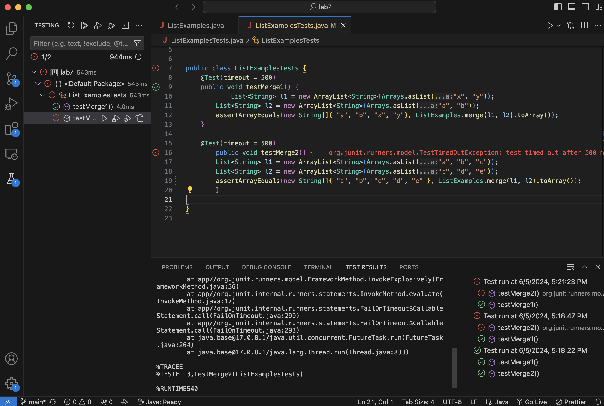
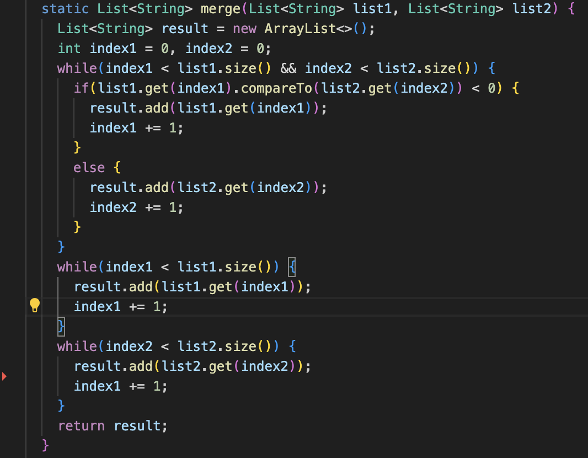
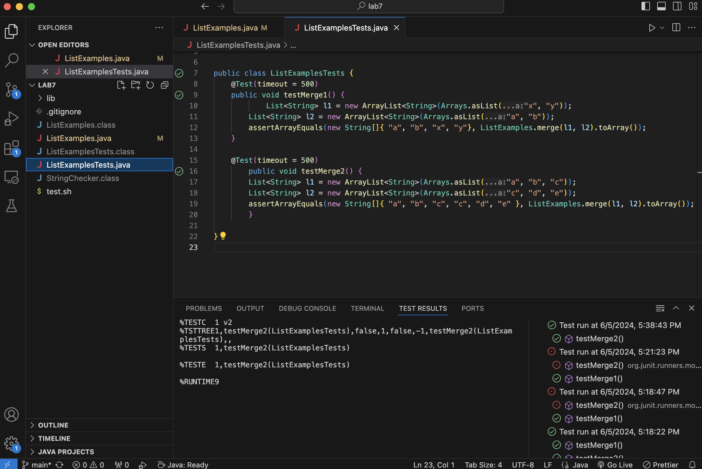
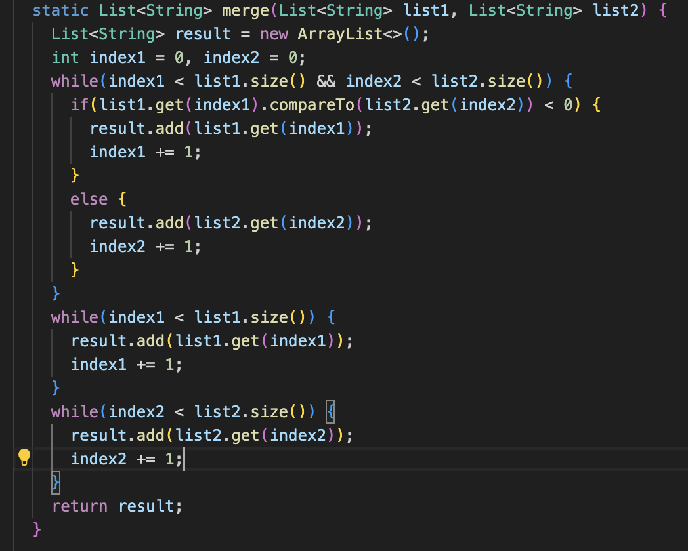
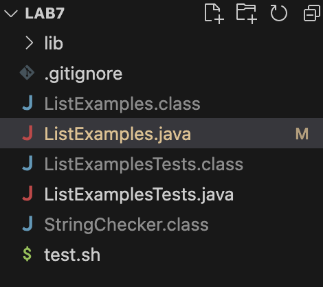

## Lab Report 5

### Original Post:
Hi, here is the symtom I have. I am not sure why one of my tests fails. My guess is that my `merge` method logic is wrong. The terminal shows `failontimeout` and may suggests that my loop logic is wrong.

### Response:
Hi. Do you think your 3rd while loop logic is correct? Also, you should check your imputs and your expected outputs. 

Check if they are what you want. You can try to use the bash command that we used in our lecture to run the tests.

### Changes:
The reason why I failed the test is because the `merge` method logic of adding element from the second list is wrong and the while loop cannot stop. I changed `index1` to `index2` in the third loop.

Also, the expected output is wrong. I missed a `"c"` in the expected output. After changing them, I craet the `test.sh` file to run tests and now, all my tests pass.

### Setup

1: All the files are under the `lab7` folder.
2: `ListExamples.java` has the merge method as the screenshot 1. And `ListExamplesTests.java`has the tests as the screenshot 2.
3: In the original post, I used the test beaker to run tests. After fixing the bugs, I create the `test.sh`. I used `bash test.sh` command to run tests.
4: I changed `index1` to `index2` in the third loop and added a `"c"` in the expected output to fix the bug.

## Part 2:
in the second half of this quarter, I learned about things like vim and debuggers. They are interesting, especially debuggers. I can debug my program by controlling the process. I can stop my program by adding stops. It's helpful when I have a long program while I frquently update my variables. I think this course is very useful because all the skills in this course are practical.
